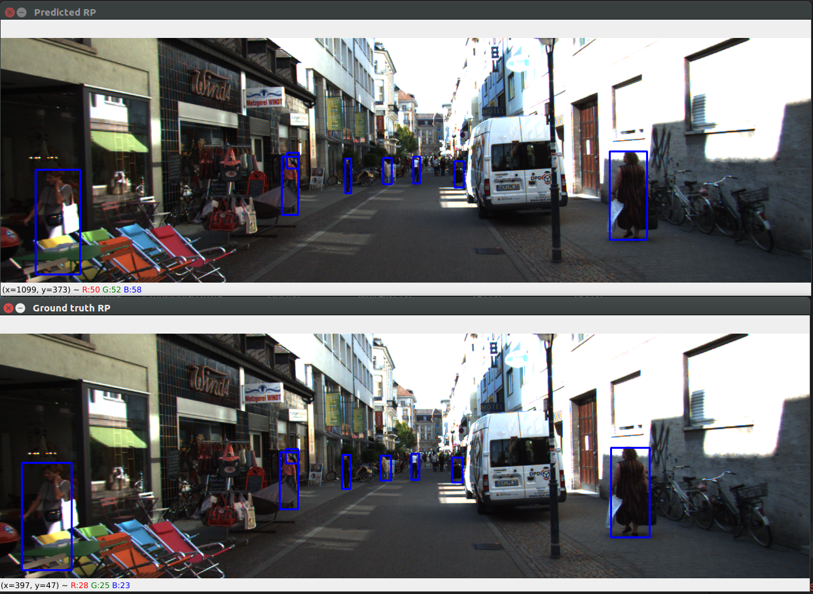

# Elf: Accelerate High-resolution Mobile Deep Vision with Content-aware Parallel Offloading

Elf is a distributed offloading solution for mobile deep vision applications. 
This repo is the implementation of [Elf](http://www.winlab.rutgers.edu/~wuyang/papers/mobicom21-final273.pdf), MobiCom 2021. 

```bibtex
@inproceedings{zhang2021ELF,
  title = {Elf: Accelerate High-resolution Mobile Deep Vision with Content-aware Parallel Offloading},
  author = {Zhang, Wuyang and He, Zhezhi and Liu, Luyang and Jia, Zhenhua and Liu, Yunxin and Gruteser, Marco and Raychaudhuri, Dipankar and Zhang, Yanyong},
  booktitle = {27th Annual International Conference on Mobile Computing and Networking (MobiCom'21)},
  year = {2021},``
  organization = {ACM},
  doi = {10.1145/3447993.3448628},
  keywords = {conference},
  link = {https://dl.acm.org/doi/abs/10.1145/3447993.3448628}
}
```

## Environment
Python 3.8

### Install python dependency
pip install -r requirements.txt

------------------------------

## Get started

## 1. Prepare computer vision processing engine
Download and install [Detectron2](https://github.com/facebookresearch/detectron2) and/ or [MMDetection](https://github.com/open-mmlab/mmdetection).

## 2. Train RP prediction

### 2.1 Download KITTI dataset
Please download [left color images of object data set](http://www.cvlibs.net/datasets/kitti/eval_tracking.php) and [training labels of object data set](http://www.cvlibs.net/datasets/kitti/eval_tracking.php).

### 2.2 Generate the training dataset 
Run object detection with Detectron2 or MMDetection upon the KITTI dataset and generate the RP coordinates in each frame. 
An example training dataset can be found in ./rp_predict/data/train.

### 2.3 Train RP prediction networks
```
python rp_predict/train.py
```

Please update rp_prediction_model in config.py to train either lstm or attention lstm model.
```
rp_prediction_model = "lstm" # train a lstm model.
rp_prediction_model = "attn" # train an attention lstm model.
```

You could use the trained networks (both LSTM and attention LSTM) from: 

- rp_predict/model/outputs/lstm_checkpoint25.pth or
- rp_predict/model/outputs/attn_lstm_checkpoint25.pth

After training the network, you may evaluate and visualize the prediction effect.
```
python rp_predict/eval.py 
```

Average loss with the evaluation dataset:
- LSTM: 0.5137 (lstm_single_checkpoint25.pth)
- Attention LSTM: 0.1784 (attn_lstm_checkpoint25.pth)

Here is an example RP prediction result along with its ground truth.



## 3. Setup Elf with a single server
If there is only a single server available and you would like to play with Elf, please refer to this section.
Please update servers and lrc_server in config.py. 
```
servers: List[Tuple[str, int]] = (
            ('localhost', 5053),
            ('localhost', 5053),
        )
"""Distributed servers to run model inference."""

lrc_server: Tuple[str, int] = ('localhost', 5053)
"""Server to run LRC service."""
```

### 3.1 Create an application interface
In order to support any computer vision application (model inference) with Elf, we need to create an application interface for them.
Please see inference_model_interface.py. We expect an user to implement the following interfaces.
Please see inference_model_detectron2.py and inference_model_mmdetect.py as examples.
```
class InferenceModelInterface(ABC):
    """
    This class wrap high level applications to interact with Elf.
    For each high level application to run with Elf, it needs to provide the below general interfaces:
    """cv                                                                                                                                                 xzAAAAAAAAAAAA  
    
    @abstractmethod
    def create_model(self):
        pass

    @abstractmethod
    def run(self, img: np.ndarray) -> Any:
        pass

    @staticmethod
    @abstractmethod
    def extract_rps(inference_result: Any) -> torch.tensor:
        pass

    @abstractmethod
    def render(self, img: np.ndarray, inference_result: Any) -> np.ndarray:
        pass
```

Meanwhile, we need to ensure the applications of interest provide those required interface. 
For example, in the case of Detectron2, please add the following code to detectron2/demo/demo.py

```
def maskrcnn_interface():
    args = get_parser().parse_args()
    cfg = setup_cfg(args)
    return VisualizationDemo(cfg)


def render(image, predictions):
    args = get_parser().parse_args()
    cfg = setup_cfg(args)
    vis_output = None
    metadata = MetadataCatalog.get(
        cfg.DATASETS.TEST[0] if len(cfg.DATASETS.TEST) else "__unused"
    )
    visualizer = Visualizer(image, metadata, instance_mode=ColorMode.IMAGE)
    if "panoptic_seg" in predictions:
        panoptic_seg, segments_info = predictions["panoptic_seg"]
        vis_output = visualizer.draw_panoptic_seg_predictions(
            panoptic_seg.to(torch.device("cpu")), segments_info
        )
    else:
        if "sem_seg" in predictions:
            vis_output = visualizer.draw_sem_seg(
                predictions["sem_seg"].argmax(dim=0).to(torch.device("cpu"))
            )
        if "instances" in predictions:
            instances = predictions["instances"].to(torch.device("cpu"))
            vis_output = visualizer.draw_instance_predictions(predictions=instances)
    return vis_output
``` 

In the case of mmdetect, please add the following code to mmdetection/tool/test.py
```
def mmdetection_interface():
    args = parse_args()
    cfg = Config.fromfile(args.config)
    cfg.model.pretrained = None
    cfg.data.test.test_mode = True
    model = init_detector(cfg, args.checkpoint)
    return model

def run(model, img):
    return inference_detector(model, img)
    
def render(app, image, predictions):
    # Optional: update if needed.
    pass
```

### 3.2 Disable image resize
In Detectron2, detectron2/detectron2/engine/defaults.py

update
``` 
image = self.aug.get_transform(original_image).apply_image(original_image)
```
to
```
image = original_image
```
in order to disable image resize.

### 3.3 Test the application interface
Please ensure you that run either Detectron2 or MMdetect through the interface defined. 
Please test with 
```
python tests/inference_model/test_inference_model_detectron2.py or
python tests/inference_model/test_inference_model_mmdetect.py
``` 

Tested version: 
- detectron2: 8745a31

## 4. Setup Elf with multiple servers

###4.1 Run server:
Please update the ip and port in config.py
On each server, please update server_index in config.py so the server can load the corresponding index.

```
# This configuration simulates two servers locally on the same node for the easy testing.
# Please update accordingly.
servers: List[Tuple[str, int]] = (
    ('localhost', 5053),
    ('localhost', 5053),
)
```

Run
```
python demo/elf_server.py
```
It initializes with "start to running service at port 5053" and waits for a request from client.

###4.2 Run Client:
Run
```
python demo/elf_client.py
```

###4.3 Demo effects

